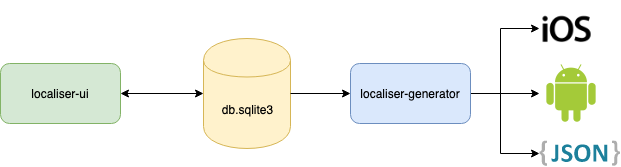

# Localiser
Manage localisation strings from a web UI and auto generate JSON language files and native iOS and Android libraries containing the strings needed in your projects.

Generated native libraries contains Swift and Kotlin type-safe mappings to easily use all your localisation strings. Follow README instructions in each auto generated library.

To build the auto generated iOS Frameworks you need to have macOS. Running localiser on a Mac is recommended to be fully operational on both mobile platforms without restrictions.

## Architecture


Localiser is comprised of the following:

* **db.sqlite3:** a database which contains all your project's localisation strings

* **localiser-ui:** a web UI interface which allows you to easily manage all the localisation strings contained in your `db.sqlite3`. The first time you start it, if you don't have an existing `db.sqlite3`, it will be automatically created for you

* **localiser-generator:** a command line generator which generates the following from the `db.sqlite3` database:
  * Native `Android` library
  * Native `iOS` library
  * [ngx-translate](https://github.com/ngx-translate/core) JSON language files

Look the [example](example) to see what you will get.

## Technology stack
* SQLite 3
* Python 3
* Jinja2
* Django
* Docker
* Xcodegen
* Gradle

## Getting Started
Your only prerequisite is having docker installed and running on your computer. Since you almost certainly are a mobile developer, I expect you to be on a macOS, so I'm not going to cover procedures in details for Linux or Windows.

Ensure your docker is running. From a terminal, execute:

```
docker pull gotev/localiser-ui && docker pull gotev/localiser-generator
```

Add this in your `~/.bash_profile`:

```
# Localiser aliases
alias localiser='docker run -t -i -v $(PWD):/localiser-ui/db -p 8000:8000 gotev/localiser-ui'
alias localiser-generator='docker run -ti --rm -v $(PWD)/generated:/localiser-generator/generated -v $(PWD)/db.sqlite3:/localiser-generator/db.sqlite3 gotev/localiser-generator'
```

save and exit, then run `source ~/.bash_profile` and you're done!

### Localiser UI
* simply navigate to the directory containing your `db.sqlite3` and run:
    ```
    localiser
    ```
    If no `db.sqlite3` is found in the directory, `localiser` creates one for you with default settings
* open your browser on http://localhost:8000 and have fun! Default credentials are (you can change them once logged):
  * username: `admin`
  * password: `admin`

### Localiser Generator
* navigate to the directory containing your `db.sqlite3` and run:
    ```
    localiser-generator "ProjectName" "exportVersion"
    ```
    `exportVersion` can be whatever you use for versioning. [Semantic Versioning](https://semver.org) is recommended.
* If everything goes right you will find a `generated` directory containing `android`, `ios` and `json` sub-directories.

## Updating
From a terminal, just execute:

```
docker pull gotev/localiser-ui && docker pull gotev/localiser-generator
```

Ensure your docker is running. After it completes, you're done and you can continue using localiser as usual.

## Database entities
```
* Locale                        you can define your own set of locales
                                use either ISO 639-1 notation (e.g. it, en, fr): https://en.wikipedia.org/wiki/List_of_ISO_639-1_codes
                                or ISO 3166-1 (e.g. it-IT, en-US): https://en.wikipedia.org/wiki/ISO_3166-1_alpha-2
                                full specification: https://tools.ietf.org/html/bcp47

* Project                       you can have N projects in your DB

    |==> Namespace              each project can have from 1 to N namespaces

        |==> Localisation Key   each namespace can have from 1 to N localisation keys

                                you can add a comment for each localisation key to better help
                                you identify its purpose and where it's supposed to be used

    |==> Translated Key         it's a localisation key translated in a specific locale

                                to speed up development and have the possibility to better
                                define a translation later, you can mark a translated key as
                                "Temporary" and change its value later. There's a filter which
                                helps you see only temporary strings

```

### Localised strings
* `UTF-8`
* Supports emojis
* Supports named placeholders in strings in the format `${ + any letter + }`. Generator recognizes only the placeholders present in project's default language values.
  * Valid placeholder: `${validPlaceholder}`
  * Some invalid placeholders: `${}`, `${1}`, `${_}`

## License
Localiser is comprised of three different parts. Each one has a different license because it serves a different purpose.
* `Localiser UI` is licensed under the GNU Affero General Public License version 3 (AGPLv3). Please find the attached full license in `localiser-ui` directory.
* `Localiser Generator` is licensed under the General Public License version 3 (GPLv3). Please find the attached full license in `localiser-generator` directory.
* `Generated Android and iOS libraries` are licensed under the Unlicense <http://unlicense.org/>. Please find the the attached full license in your auto-generated libraries directory.
